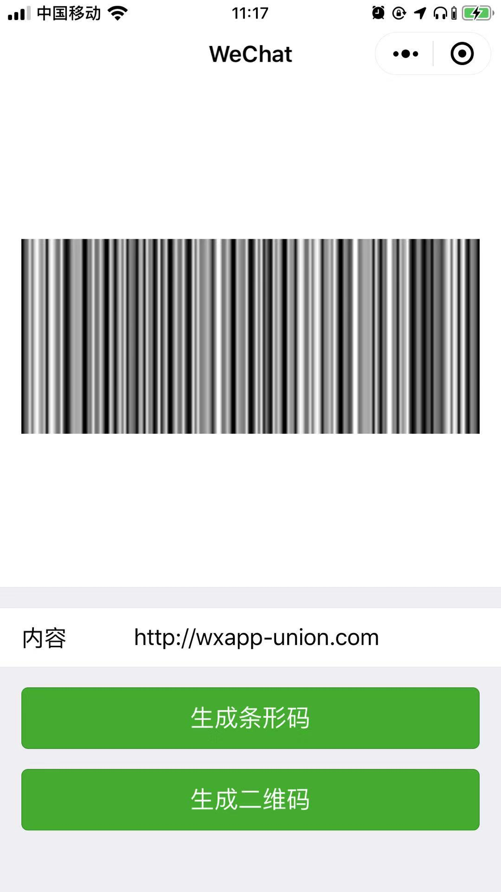

# wxapp-qbcode
**在小程序中快速生成条形码、二维码**

## Usage
**先在 wxml 文件中，创建绘制的 canvas，并定义好 width, height, canvasId 。**
```
<canvas style="width: 686rpx;height: 160rpx;" canvas-id="canvasBarId"/>
<canvas style="width: 686rpx;height: 686rpx;" canvas-id="canvasQrId"/>
```

**使用小程序开发者工具->构建 npm，或引入js文件，使用Barcode绘制条形码、使用Qrcode绘制二维码**
```
import { Qrcode, Barcode } from '../../miniprogram_npm/wxapp-qbcode/index';

Barcode({
  width: 200,
  height: 200,
  canvasId: 'canvasBarId',
  text: '3444556c55',
})

Qrcode({
  width: 200,
  height: 200,
  canvasId: 'canvasQrId',
  text: 'https://github.com/github-seayon',
  image: {
    imageResource: '../../images/icon.png,
    destWidth: 100,
    destHeight: 100
  }
})


```

## Demo

**条形码示例**



**二维码示例**


## Api

### Barcode([options])

**options**

**Type:Object**

参数 | 说明 |  示例  
-|-|-
width | 必须，二维码宽度，与canvas的width保持一致 | 375 |
height | 必须，二维码高度，与canvas的height保持一致 | 160 |
canvasId | 必须 canvas-id | 'canvasBarId' |
text | 必须 条形码内容 | '4445t55ddd' |
usingIn | 非必须，若在组件中使用，需要传入 | this |
x | 非必须，二维码绘制的 x 轴起始位置，默认值0 | 100 |
y | 非必须，二维码绘制的 y 轴起始位置，默认值0 | 100 |
fontColor | 非必须，条形码颜色，默认值#000000 | '#000000' |
backColor | 非必须，背景色，默认值#FFFFFF | '#FFFFFF' |
callback |非必须，绘制完成后的回调函数，v0.8.0+版本支持。安卓手机兼容性问题，可通过自行设置计时器来解决，更多可以参考 [issue #18](https://github.com/yingye/weapp-qrcode/issues/18) | function (e) { console.log('e', e) } |


### Qrcode([options])

**options**

**Type:Object**

参数 | 说明 |  示例  
-|-|-
width | 必须，二维码宽度，与canvas的width保持一致 | 375 |
height | 必须，二维码高度，与canvas的height保持一致 | 160 |
canvasId | 必须 canvas-id | 'canvasBarId' |
text | 必须 条形码内容 | '4445t55ddd' |
typeNumber | 非必须，二维码的计算模式，默认值-1容 | 8 |
correctLevel | 非必须，二维码纠错级别，默认值为高级，取值：{ L: 1, M: 0, Q: 3, H: 2 } | 1 |
usingIn | 非必须，若在组件中使用，需要传入 | this |
x | 非必须，二维码绘制的 x 轴起始位置，默认值0 | 100 |
y | 非必须，二维码绘制的 y 轴起始位置，默认值0 | 100 |
fontColor | 非必须，条形码颜色，默认值#000000 | '#000000' |
backColor | 非必须，背景色，默认值#FFFFFF | '#FFFFFF' |
image | 非必须，在 canvas 上绘制图片，层级高于二维码 | { imageResource: '', dx: 0, dy: 0, destWidth: 100, destHeight: 100 } |
callback |非必须，绘制完成后的回调函数，v0.8.0+版本支持。安卓手机兼容性问题，可通过自行设置计时器来解决，更多可以参考 [issue #18](https://github.com/yingye/weapp-qrcode/issues/18) | function (e) { console.log('e', e) } |

